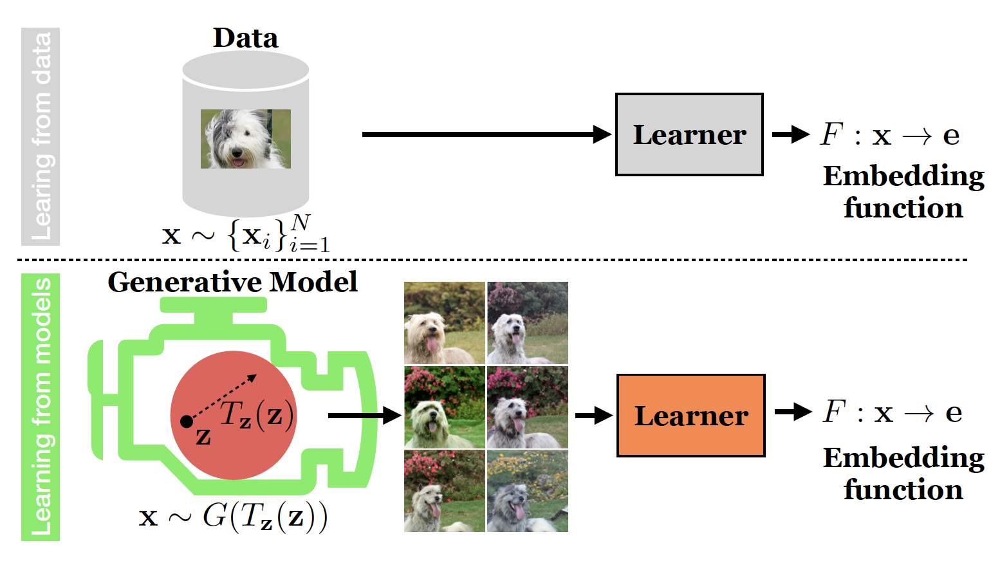

# GenRep
[Project Page](https://ali-design.github.io/GenRep/) |  [Paper](https://arxiv.org/abs/2106.05258) 

  

Generative Models as a Data Source for Multiview Representation Learning\
[Ali Jahanian](http://people.csail.mit.edu/jahanian), [Xavier Puig](https://people.csail.mit.edu/xavierpuig/), [Yonglong Tian](https://people.csail.mit.edu/yonglong/), [Phillip Isola](http://web.mit.edu/phillipi/)

## Prerequisites
- Linux
- Python 3
- CPU or NVIDIA GPU + CUDA CuDNN

**Table of Contents:**<br>
1. [Setup](#setup)<br>
2. [Visualizations](#visualizations) - plotting image panels, videos, and distributions<br>
3. [Training](#training) - pipeline for training your encoder<br>
4. [Testing](#testing) - pipeline for testing/transfer learning your encoder<br>
5. [Notebooks](#notebooks) - some jupyter notebooks, good place to start for trying your own dataset generations<br>
5. [Colab Demo](#colab) - a colab notebook<br>

<a name="setup"/>

## Setup

- Clone this repo:
```bash
git clone https://github.com/ali-design/GenRep
```

- Install dependencies:
	- we provide a Conda `environment.yml` file listing the dependencies. You can create a Conda environment with the dependencies using:
```bash
conda env create -f environment.yml
```

- Download resources:
	- we provide a script for downloading associated resources. Fetch these by running:
```bash
bash resources/download_resources.sh
```

<a name="visualizations"/>

## Visualizations

**Plotting image panels:**
<br>


- Run `plots.ipynb` to get the plots in the paper. We added some pretrained weights in the `./models_pretrained` if you want to run tests on them, but you can also use the models you train yourself.
<!-- 
```bash
python vis_image.py \
	models_pretrained/biggan_zoom_linear_lr0.0001_l2/model_20000_final.ckpt \
	models_pretrained/biggan_zoom_linear_lr0.0001_l2/opt.yml \
	--gpu 0 --num_samples 50 --noise_seed 20 --truncation 0.5 --category 207

python vis_image.py \
        models_pretrained/stylegan_color_linear_lr0.0001_l2_cats_w/model_2000_final.ckpt \
        models_pretrained/stylegan_color_linear_lr0.0001_l2_cats_w/opt.yml \
        --gpu 1 --num_samples 10 --noise_seed 20 
```

- By default this will save generated images to `<output_dir>/images` specified in the config yml, unless overwritten with the `--output_dir` option -->

<br>

<!-- **To make a videos:**
<br>


```bash
python vis_video.py [CHECKPOINT] [CONFIG] --gpu [GPU] --noise_seed [SEED] --sample [SAMPLE]

python vis_video.py models_pretrained/biggan_color_linear_lr0.001_l2/model_20000_final.ckpt \
	models_pretrained/biggan_color_linear_lr0.001_l2/opt.yml  --gpu 0 --sample 10 \
	--noise_seed 20 --truncation 0.5 --category 538 --min_alpha -1 --max_alpha 0
```

- By default this will save output to `<output_dir>/video` specified in the config yml, unless overwritten with the `--output_dir` and `--filename` options
<br>

**To draw distributions:**
<br>


To draw distributions, you will need to have downloaded the object detector through `resources/download_resources.sh` (for objects) or installed dlib through `environment.yml` (for faces). 
```bash
python vis_distribution.py [CHECKPOINT] [CONFIG] --gpu [GPU]

python vis_distribution.py models_pretrained/biggan_shiftx_linear_lr0.001_l2/model_20000_final.ckpt \
	models_pretrained/biggan_shiftx_linear_lr0.001_l2/opt.yml  --gpu 0
```
- By default this will save output to `<output_dir>/distribution` specified in the config yml, unless overwritten with the `--output_dir` option
-->
<a name="training"/> 

## Training encoders
- The current implementation covers these variants:
	- Contrastive (SimCLR and SupCon)
	- Inverters
	- Classifiers
- Some examples of commands for training contrastive encoders:
```bash
# train a SimCLR on an unconditional IGM dataset (e.g. your dataset is generated by a Gaussian walk, called my_gauss in a GANs model)
CUDA_VISIBLE_DEVICES=0,1 python main_unified.py --method SimCLR --cosine \ 
	--dataset path_to_your_dataset --walk_method my_gauss \ 
	--cache_folder your_ckpts_path >> log_train_simclr.txt &

# train a SupCon on a conditional IGM dataset (e.g. your dataset is generated by steering walks, called my_steer in a GANs model)
CUDA_VISIBLE_DEVICES=0,1 python main_unified.py --method SupCon --cosine \
	--dataset path_to_your_dataset --walk_method my_steer \ 
	--cache_folder your_ckpts_path >> log_train_supcon.txt &
```
- If you want to find out more about training configurations, you can find the `yml` file of each pretrained models in `models_pretrained`

<a name="testing"/> 

## Testing encoders
- You can currently test (i.e. trasfer learn) your encoder on:
	- ImageNet linear classification
	- PASCAL classification
	- PASCAL detection
- An example of commands for linear classification:
```bash
# test your unconditional or conditional IGM trained model (i.e. the encoder you trained in the previous section) on ImageNet
CUDA_VISIBLE_DEVICES=0,1 python main_linear.py --learning_rate 0.3 \ 
	--ckpt path_to_your_encoder --data_folder path_to_imagenet \
	>> log_test_your_model_name.txt &
```

<a name="notebooks"/> 

## Notebooks

- We provide some examples of jupyter notebooks illustrating the full training pipeline. See [notebooks](./notebooks).
- If using the provided conda environment, you'll need to add it to the jupyter kernel:
```bash
source activate genrep_env
python -m ipykernel install --user --name genrep_env
```

<a name="colab"/>

## Colab

- You can find a google colab notebook implementation [here].

### Citation
If you use this code for your research, please cite our paper:

```
@article{jahanian2021generative, 
	title={Generative Models as a Data Source for Multiview Representation Learning}, 
	author={Jahanian, Ali and Puig, Xavier and Tian, Yonglong and Isola, Phillip}, 
	journal={arXiv preprint arXiv:2106.05258}, year={2021} }
```


